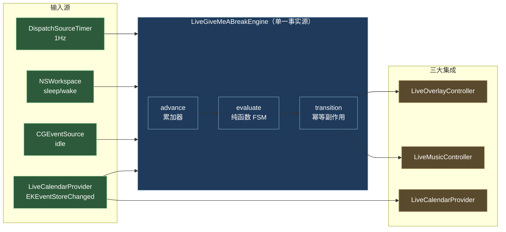

<div align="center">

# Give me a break 🍅

**macOS 菜单栏强制作息应用**

在自定义工作时段内执行「工作 / 强制休息」节律，休息时**遮罩全部显示器**并**播放舒缓音效**（内置粉噪音 + 可选 QQ 音乐联动）；接入 **Google 日历**会议，会议计为工作时间但**休息自然后延**。

  

</div>

## 设计哲学

熵减：用「上下文驱动、最小干预、循证工程」原则，对抗每天作息的无序。完整设计与循证调研见 [设计文档](./docs/give-me-a-break-design.md)，协作规约见 [AGENTS.md](./AGENTS.md)。

## 核心能力

- **强制排版作息**：工作窗口内每累计 N 分钟（默认 50）→ 强制休息 M 分钟（默认 10）。
- **全屏遮罩**：休息时遮罩所有显示器（`CGShieldingWindowLevel`，压过菜单栏/Dock/全屏），按 Esc 需**二次确认**才可提前结束（软强制，留逃生阀）。
- **高清动效屏保**：遮罩背景内置 5 组程序化动效——**涟漪光球 · 冷雾纤丝 · 字雨微光 · 水波光斑 · 丝绸流光**（Metal 片元着色器逐像素合成，零位图资产 → 4K/8K 同样清晰；原生 DPR + 超采样抗锯齿 + 高频细节层）。设置「通用」页切换，手动遮罩与休息遮罩共用；系统开启「减弱动态效果」时自动静帧，Metal 不可用时自动回退深色渐变。
- **屏幕遮罩（手动）**：全局快捷键 **⌃⌥⌘K**、菜单「屏幕遮罩」或系统锁屏快捷键 Control+Command+Q（拦截后不真正锁屏，改为进入本 App 遮罩；需「输入监控」授权）随时手动进入同款全屏遮罩，电脑后台照常运行，仅阻断新的鼠标/键盘输入；双击 Esc 退出。遮罩期间**工作计时冻结**（计划性休息及其小结窗不会打断遮罩，遮罩时长也不计入工作累加）；「立即休息」（⌃⌥⌘R）仍可主动接管（遮罩自动让位）。
- **休息音效**：进入休息播放**自定义音频**（在设置选择本地 mp3/m4a/aac/wav/flac 等文件，循环播放，取代内置粉噪音；文件不打包不分发，仅以本地路径引用，缺失/不可用自动回退粉噪音）或内置**粉噪音**（AVAudioEngine 实时合成，零音频文件、可靠）；可选叠加联动 QQ 音乐（经系统 Now Playing 路由的 CGEvent 媒体键）。结束休息自动停止。均可在设置中配置。
- **Google 日历门控**：会议计为工作时间，但休息推迟到会议结束。例：工作 30min 后接 30min 会议 → 连续工作 60min，会议结束才开始 10min 休息。
- **工作日志（认知闭合仪式）**：自然休息前弹一个轻量输入框，花 30 秒写下「刚刚完成了什么 + 可选下一步」，让大脑真正放下再休息（循证：Leroy 注意力残留 / Stubblebine 插值日记）。记录按时间段落盘，菜单「工作日志…」一键生成今日/本周/月报 Markdown，支持复制与导出。永不阻塞休息：回车提交 / Esc 跳过 / 关窗放行 / 到点自动放行（等待时长可在设置调整，默认 3 分钟）；亦可设「永久等待」让窗口停留至手动操作，或在设置关闭整个环节；「立即休息」不弹。
- **运动记录 + 综合报告**：与工作日志对称——**休息自然结束时**弹轻量输入框，记录这段休息里做的微运动（如胯下击掌 / 提膝击掌 / 深蹲 / 俯卧撑），每条含「运动时段 + 若干（类型 × 数量）」；提前结束（Esc）与被会议、下班打断均不弹。运动记录与工作日志一并汇入菜单「综合报告…」，按**周 / 月 / 季 / 年**合成原生层级报告（工作 Top N + 周期分布、运动按类型聚合 + 明细），支持复制与导出 Markdown。
- **防止空闲睡眠**：菜单「防止睡眠」勾选项或设置「电源」页一键开启（两处**即时生效**，同「开机自启」语义）——经 IOKit 原生电源断言（与 `caffeinate -d` / `-d -i` 同机制，非子进程）阻止电脑因空闲而熄屏/睡眠，**无需任何权限**；防护范围（仅显示器 / 显示器 + 系统）在设置「电源」页配置、随「应用」提交，状态持久化、重启后自动恢复，`pmset -g assertions` 可观测。与休息 / 工作 / 遮罩模式完全独立，不影响主动睡眠（合盖、Apple 菜单睡眠、低电量）。
- **健壮性**：AFK/睡眠暂停累加（不回灌）、崩溃恢复（fast-forward）、多屏热插拔、状态持久化。

## 架构总览



**正交分解**（[详细 FSM](./docs/give-me-a-break-design.md#调度引擎)）：`evaluate` 是零时间依赖纯函数（注入虚拟时钟可测）；`LiveGiveMeABreakEngine` 仅汇聚输入 + 调用纯函数 + 幂等分发；三大 Controller 各封装系统 API 与权限。三模块：`GiveMeABreakEngine`（纯核心）、`GiveMeABreakIntegrations`（AppKit/EventKit/CGEvent）、`GiveMeABreak`（@main 壳）。

## 下载与安装（Release 资产）

从 [Releases](https://github.com/ThreeFish-AI/give-me-a-break/releases) 下载对应平台 zip。macOS 产物为**稳定自签名**（10 年期 codeSigning 证书，未公证）：**TCC 权限（辅助功能 / 输入监控 / 日历）授权一次、跨版本升级持久**；Gatekeeper 对「未知开发者」应用仍会拦截**首次**打开（彻底消除需 Apple 公证，$99/年，演进链路已预留，见[签名与 TCC 授权](#签名与-tcc-授权一次授权跨版本持久)）。

**macOS 一键安装（推荐，安装/升级通用）**：

```bash
curl -fsSL https://raw.githubusercontent.com/ThreeFish-AI/give-me-a-break/master/install.sh -o install.sh
bash install.sh              # 最新正式版；指定版本：bash install.sh v0.1.8
```

脚本自动完成：下载 Release zip → 去隔离 → 替换 `/Applications/GiveMeABreak.app` → 启动。

**macOS 手动安装**：解压后将 `GiveMeABreak.app` 拖入 `/Applications`，执行一次去隔离再启动（macOS 15 起已无右键「打开」旁路）：

```bash
xattr -dr com.apple.quarantine /Applications/GiveMeABreak.app
```

**Windows 10/11 x64**（`give-me-a-break-*-win64.zip`）：自包含、未签名。SmartScreen 提示时点「更多信息 → 仍要运行」；因低级键盘钩子（`WH_KEYBOARD_LL`）+ `SendInput` 媒体键，可能被 Defender / 360 / 火绒**误报**，需手动放行。解压后运行 `GiveMeABreakShell.exe`。

## 环境要求

- **macOS 14+**（Sonoma 及以上，本机实测 macOS 26.5.1）。
- **Swift 工具链**：Command Line Tools 即可（`swift --version` ≥ 6.0）。**无需安装完整 Xcode**——本工程用 Swift Package Manager + `Makefile` 手工装配 `.app`。
- `codesign` / `xcrun notarytool` 随 Command Line Tools 附带。

## 构建与运行

```bash
# 装配 GiveMeABreak.app（默认 ad-hoc 签名；配置 Makefile.local 后为稳定自签名）并运行
make run

# 或分步
make build      # swift build -c release
make app        # 装配 .app + codesign + 清 quarantine（签名身份见「签名与 TCC 授权」）
open GiveMeABreak.app

# 单元测试（自建运行器，CLT 无 XCTest）
make test
```

**快速验证遮罩/音乐/工作日志**（⚠️ 会遮罩你的屏幕约 15 秒）：

```bash
GIVEMEABREAK_DEBUG=1 .build/release/GiveMeABreak
# → 8s 工作 → 工作日志输入框（DEBUG 旁路 15min 门控）→ 回车/跳过 → 全屏遮罩 + 拉起 QQ 音乐 → 15s 后自动退出遮罩 + 暂停音乐
```

## 权限授予（首次运行，全部由你在系统设置手动完成）

Give me a break 是**非沙盒**应用（沙盒会阻断媒体键与日历自动化）。运行后请在「系统设置 → 隐私与安全性」依次授予：

| 权限                             | 用途                                                     | 触发时机                                             |
| -------------------------------- | --------------------------------------------------------- | ------------------------------------------------------ |
| **辅助功能 (Accessibility)**     | CGEvent 合成媒体键控制 QQ 音乐                             | 首次启动弹引导窗                                        |
| **完全日历访问**                 | EventKit 读取 Google 日历会议                              | 首次启动请求                                            |
| **输入监控 (Input Monitoring)**  | `CGEventTap` 拦截系统锁屏快捷键（Control+Command+Q），触发「屏幕遮罩」而非真正锁屏 | 首次启动尝试接管快捷键时；未授权时自动降级，仅菜单「屏幕遮罩」可用（**授权后需重启 App 才生效**，非热更新） |
| **自动化 (Automation)**          | 仅当未来启用 AppleScript 回退时                            | 按需                                                     |

> Agent 不得绕过任何权限授予——均由用户在系统设置完成（同构于 [浏览器验证协议](./.agents/browser-validation.md) 的登录态红线）。

## 签名与 TCC 授权（一次授权，跨版本持久）

TCC 权限是否在升级后保留，取决于**代码签名身份是否稳定**：ad-hoc 签名（`codesign -s -`）的 Designated Requirement 绑定 cdhash，每次构建都变，TCC 视为不同应用 → 授权失效；稳定证书签名的 DR 绑定证书 CN → 跨构建不变 → 授权持久（见 [issue #5](./.agents/issue.md)）。

**本机一次性配置**（开发者，此后 `make app` 稳定签名、TCC 不再反复弹）：

```bash
bash scripts/create-signing-cert.sh   # 创建 10 年期自签名 codeSigning 证书（含一步 sudo 信任）
                                       # 并自动写入仓库根 Makefile.local（gitignored）
```

**CI 一次性配置**（让 Release 产物同享稳定签名，下载用户 TCC 同样一次授权）：

| GitHub 设置项                     | 类型     | 值                                                        |
| --------------------------------- | -------- | ---------------------------------------------------------- |
| `MACOS_SELFSIGN_P12`              | Secret   | `base64 -i .temp/signing/selfsign.p12 \| pbcopy` 的结果     |
| `MACOS_SELFSIGN_P12_PWD`          | Secret   | 创建证书时输入的 p12 密码                                   |
| `KEYCHAIN_PASSWORD`               | Secret   | 任意强密码（CI 临时 keychain 用）                           |
| `SELFSIGN_IDENTITY`               | Variable | `GiveMeABreak Release`                                      |

配置后 [release.yml](./.github/workflows/release.yml) 自动以同一证书重签 Release 产物（未配置则维持 ad-hoc，行为不变；Developer ID + 公证链路已逐字预留，购置后仅配置即启用）。

> **迁移提示**：从 ad-hoc 版本升级到稳定签名版本时，TCC 权限需**最后一次**重新授权，此后跨版本持久；旧 ad-hoc 的孤儿授权记录可在系统设置手动移除，或经 `tccutil reset` 按权限整体重置。

## 快捷键

| 快捷键 | 动作 | 生效范围 | 前置条件 |
| --- | --- | --- | --- |
| **⌃⌥⌘K** | 屏幕遮罩 | 全局（任意应用前台） | 无（零权限） |
| **⌃⌥⌘R** | 立即休息 | 全局（任意应用前台） | 无（零权限） |
| **⌃⌘Q** | 进入屏幕遮罩（接管系统锁屏快捷键） | 全局 | 「输入监控」权限 + 授权后重启 App |
| 菜单项裸字母（R/K/L/,/Q） | 对应菜单项 | 仅状态栏菜单展开时 | 无 |

- ⌃⌥⌘K/⌃⌥⌘R 经系统 `RegisterEventHotKey`（Carbon HIToolbox）注册，事件被系统消费、**不会透传给前台应用**，也无需任何权限。
- ⌃⌘Q 劫持依赖 `CGEventTap`：未授权「输入监控」时该组合键保持系统原生锁屏（预期降级，⌃⌥⌘K 不受影响）；授权后需重启 App 才生效。Release 产物与本机构建（配置 `Makefile.local` 后）均为**稳定自签名，TCC 授权跨版本持久**；从旧 ad-hoc 构建升级而来时需重新授权一次（见[签名与 TCC 授权](#签名与-tcc-授权一次授权跨版本持久)）。
- 菜单项裸字母快捷键为 macOS 状态栏菜单的原生行为：仅在菜单展开时可选中所选项，**并非全局热键**。

## QQ 音乐与 Google 日历准备

- **休息音效（默认开）**：内置**粉噪音**无需任何准备，开箱即用。可选联动 **QQ 音乐**：安装至 `/Applications/QQMusic.app` 并授予辅助功能权限（其注册为系统 Now Playing 应用，故媒体键可路由控制；**不可** AppleScript 脚本化，已二进制验证）。两者均可在设置中开关。
- **应用图标**：装配自动生成（`leaf.fill` 绿叶 + teal 渐变 squircle，方案 A）。
- **Google 日历**：在「系统设置 → Internet 账户」添加 Google 账户并启用日历 → 经 CalDAV 同步至 macOS 日历 → EventKit 自动可见（**无 OAuth 代码**，复用 OS 登录态）。

## 配置

配置文件：`~/Library/Application Support/com.aurelius.givemeabreak/config.json`（缺失则用默认；旧版配置自动平滑迁移）。默认即用户所述作息：

```json
{
  "schemaVersion": 10,
  "workWindows": [
    { "start": { "hours": 9 }, "end": { "hours": 12 } },
    { "start": { "hours": 13, "minutes": 40 }, "end": { "hours": 18 } }
  ],
  "workIntervalSeconds": 3000,
  "restDurationSeconds": 600,
  "afkThresholdSeconds": 180,
  "ambientSoundEnabled": true,
  "controlQQMusic": true,
  "workLogEnabled": true,
  "restMusicPath": null,
  "workLogPromptTimeoutSeconds": 180,
  "exerciseLogEnabled": true,
  "exercisePromptTimeoutSeconds": 180,
  "exerciseTypes": ["胯下击掌", "提膝击掌", "深蹲", "俯卧撑"],
  "agent": { "claudeExecutablePath": null, "claudeSettingsEditorBundleId": null },
  "power": { "preventIdleSleepEnabled": false, "mode": "displayOnly" },
  "screenMask": { "effect": "orb" }
}
```

> **Agentic AI（v8 新增，功能预留）**：`agent` 子块为后续 Agentic AI 功能预留的配置——`claudeExecutablePath` 覆盖 Claude Code 可执行文件路径（`null`/空即自动从系统 `PATH` 探测，推荐）；`claudeSettingsEditorBundleId` 记住「Claude 设置」快捷打开所用编辑器的 bundle id（`null` 即系统默认关联应用）。二者仅持久化 + 设置界面可视化编辑，**当前尚未接入任何 Claude Code 调用**。
>
> **遮罩特效（v10 新增）**：`screenMask` 子块为遮罩视觉配置——`effect` 背景特效（`orb` 涟漪光球 / `fibers` 冷雾纤丝 / `letterRain` 字雨微光 / `caustics` 水波光斑 / `silk` 丝绸流光，默认 `orb`，未知值回退默认）。引擎不消费本子块（与调度逻辑完全正交），仅集成层 `Overlay/MaskEffects` 消费；着色器于首次遮罩升起时运行时编译（约 100ms，被 0.4s 淡入掩盖）。
>
> **电源（v9 新增）**：`power` 子块为「防止空闲睡眠」的配置——`preventIdleSleepEnabled` 总开关（默认 `false`，重启后自动恢复）；`mode` 防护范围（`displayOnly` = 仅显示器断言，等同 `caffeinate -d`；`displayAndSystem` = 显示器 + 系统双断言，等同 `caffeinate -d -i`）。引擎不消费本子块（与休息 / 工作 / 遮罩调度完全正交），仅集成层 `IdleSleepGuard` 消费。

工作日志单独持久化为 `work-log.json`（同目录），schema 见 [shared/work-log.schema.json](./shared/work-log.schema.json)；报告生成（今日/本周/月报 Markdown）见菜单「工作日志…」。运动记录单独持久化为 `exercise-log.json`（同目录）；与工作日志合成的综合报告（周/月/季/年 Markdown）见菜单「综合报告…」。

可在**设置窗口**图形化编辑（即时保存 + 引擎热更新，无需手动改 JSON）。设置窗口按功能域分页：**通用 · 电源 · 作息 · 休息音效 · 工作日志 · 运动记录 · Agentic AI**;其中「通用」页除「开机自启」外还可切换**遮罩特效**（随「应用」提交，下次遮罩升起生效）；「Agentic AI」页为后续 Agentic AI 功能预留——配置 Claude Code 可执行文件路径覆盖，并可在选定编辑器（自动探测已安装的 VS Code / Cursor 等）中一键打开 `~/.claude/settings.json`；「电源」页配置「防止空闲睡眠」（总开关即时生效，防护范围随「应用」提交）。菜单栏显示「英文状态 + 倒计时」（如 `Work 23′` / `Break 8′`），下拉菜单按动作分组：**立即休息 · 屏幕遮罩** ┃ **工作日志 · 综合报告**（查看）┃ **补录工作 · 补录运动**（录入）┃ **设置 · 防止睡眠 · 开机自启** ┃ **退出**（文案统一 2~4 字）；「开机自启」已迁入设置窗口的「一般」分组；「防止睡眠」总开关与「开机自启」同为即时生效的非草稿项，其防护范围配置在「电源」页。

## 验证

- **单元测试**：`make test`（91 用例，<1s）覆盖 FSM 谓词优先级、工作示例（30+30→60→10）、AFK 冻结、睡眠不回灌、fast-forward、区间合并、工作日志记录/报告/补录、运动记录/综合报告（周/月/季/年）、运动类型注册表与补录默认时段纯函数、onPostBreak 触发不变量、配置迁移（v3→v9，含 v7→v8 Agentic AI 与 v8→v9 电源设置容错迁移）等。详见 [设计文档](./docs/give-me-a-break-design.md#测试矩阵)。
- **端到端**（真机，三权限 + QQ 音乐 + Google 账户）：`GIVEMEABREAK_DEBUG=1` 观察遮罩/音乐周期；正常时段等待 50min 触发；日历建会议验证推迟。

## 已知限制（透明披露）

- **强制休息无法阻止 force-quit**：Cmd-Opt-Esc / `kill` 始终可终止——这是 macOS 设计，非恶意软件。软强制提供摩擦而非硬锁。
- **QQ 音乐联动依赖外部条件**：媒体键控 QQ 音乐需 (a) 已安装 `/Applications/QQMusic.app`、(b) 已授辅助功能权限、(c) QQ 音乐注册为 Now Playing，任一不满足即静默失败（toggle 语义还可能在播放中误暂停）。**故默认叠加内置粉噪音**作为可靠休息音效——无论 QQ 音乐是否可用都有声。失败原因见 Console.app 日志（`[GiveMeABreak][music]`）。详见 [issue #3](./.agents/issue.md)。
- **日历过滤近似**：「仅 Google」靠 `.calDAV` 源过滤；若有其他 CalDAV 账户（Yahoo/Fastmail）会被纳入。
- **macOS 26 `canBecomeKey`**：遮罩面板设为可成为 key 以收 Esc；beta 期有崩溃报告，需目标版本实机回归（已预置 [issue](./.agents/issue.md)）。
- **「屏幕遮罩」非真正锁屏，且仅拦截默认快捷键**：与强制休息同为「软强制」——Cmd-Opt-Esc 强制退出 App 仍可绕过。系统锁屏快捷键拦截固定为 macOS 默认的 Control+Command+Q；若你在「系统设置」自定义过锁屏快捷键，拦截不会跟随生效（仍可用菜单「屏幕遮罩」手动触发）。**如需触发真正的系统锁屏，请改用 Apple 菜单 →「锁定屏幕」**（或系统设置里你自定义的锁屏快捷键）。此外，任意 App 持有 Secure Input（如密码框、Terminal「安全键盘输入」）时，全机所有 `CGEventTap` 会被系统静默禁用，此刻按 Control+Command+Q 仍会触发真正锁屏——这是 macOS 设计，非本 App 缺陷。

## 项目结构

```
├── Package.swift                  # SPM：GiveMeABreakEngine / GiveMeABreakIntegrations / GiveMeABreak 三目标
├── Sources/
│   ├── GiveMeABreakEngine/             # 纯 Foundation：FSM + evaluate 纯函数 + 模型 + 持久化
│   ├── GiveMeABreakIntegrations/       # AppKit/EventKit/CGEvent：遮罩 + 音乐 + 日历 + 心跳 + 装配
│   └── GiveMeABreak/                   # @main 壳 + AppDelegate
├── tests/                         # 自建测试运行器（Harness + Cases + main）
├── docs/give-me-a-break-design.md         # 设计文档（FSM + IEEE 引用）
├── Makefile / Resources/          # .app 装配 + Info.plist + entitlements
└── .agents/                       # 协作文档（knowledge-map / issue / 引用规范）
```

## Windows 移植（进行中）

macOS 是当前主版本。Windows 版采用 **C#/.NET 8 WPF 重写**（非 Swift 直编——77% 代码绑定 Apple 专有框架，Windows 物理不存在，详见 [`docs/windows-port-design.md`](./docs/windows-port-design.md) §2 循证）。

**进展**（Swift `Sources/` 零改动，C# 平行重写）：

- **Phase 0 ✅**：`windows/GiveMeABreakEngine/` C# 重写纯核心 + `shared/` 黄金 fixture（两端共用同一份 JSON 保证 FSM 不漂移），xUnit 25 + Swift 47 双端全绿。
- **Phase 1 ✅**：`windows/GiveMeABreakEngine.Win32/`（net8.0 互操作层，18 测试 macOS 本地可验证）+ `windows/GiveMeABreakShell/`（net8.0-windows WPF 最小壳：NAudio 粉噪音 + SendInput 媒体键 + H.NotifyIcon 托盘）。**验证靠 CI**（macOS 无法运行 Windows-only 代码）：L1 双平台 net8.0 测试、L2 壳编译、L3 headless 烟测。
- **Phase 2 ✅**：全屏强制遮罩（`WS_EX_TOPMOST` + `WH_KEYBOARD_LL` soft-force + Esc 双语义，§5 妥协设计）；CI 验证接入闭环，真实覆盖/键盘拦截/Esc 双语义归真机验收。
- **Phase 3 ✅**：日历门控（Microsoft Graph + MSAL 设备码 + 条件注入降级，解析层/缓存/Provider mock 12 测试可验）；OAuth 授权与真实会议数据归 Windows 真机验收（CI 无账户）。
- **Phase 4 ✅**：CI 多平台 Release（`release.yml` 3-job matrix，打 tag 即同时发布 macOS + Windows 双 asset）；Windows 暂无签名（SmartScreen 告知，签名留后续 Azure Trusted Signing/证书单独 workflow）。

**Windows 构建**（需 Windows + .NET 8 SDK，macOS 无法编译 WPF 工程）：

```powershell
dotnet build windows/GiveMeABreakShell/GiveMeABreakShell.csproj -c Release
dotnet publish windows/GiveMeABreakShell/GiveMeABreakShell.csproj -c Release -r win-x64 --self-contained -o ./publish
.\publish\GiveMeABreakShell.exe
```

配置文件：`%APPDATA%\com.aurelius.givemeabreak\`（与 macOS 同 schema）。**真机验收限制**：托盘图标、粉噪音出声、QQ 音乐联动、全屏遮罩覆盖/键盘拦截需在 Windows 真机验收（CI 无 explorer shell/音频设备/QQ 音乐/桌面会话）；CI 验证接入闭环与不崩。

---

<div align="center">
  <sub>Built with 🧠, ❤️, and an absurd amount of coffee by <a href="https://github.com/ThreeFish-AI">ThreeFish-AI</a> · Released under the <a href="./LICENSE">MIT License</a>.</sub>
</div>
